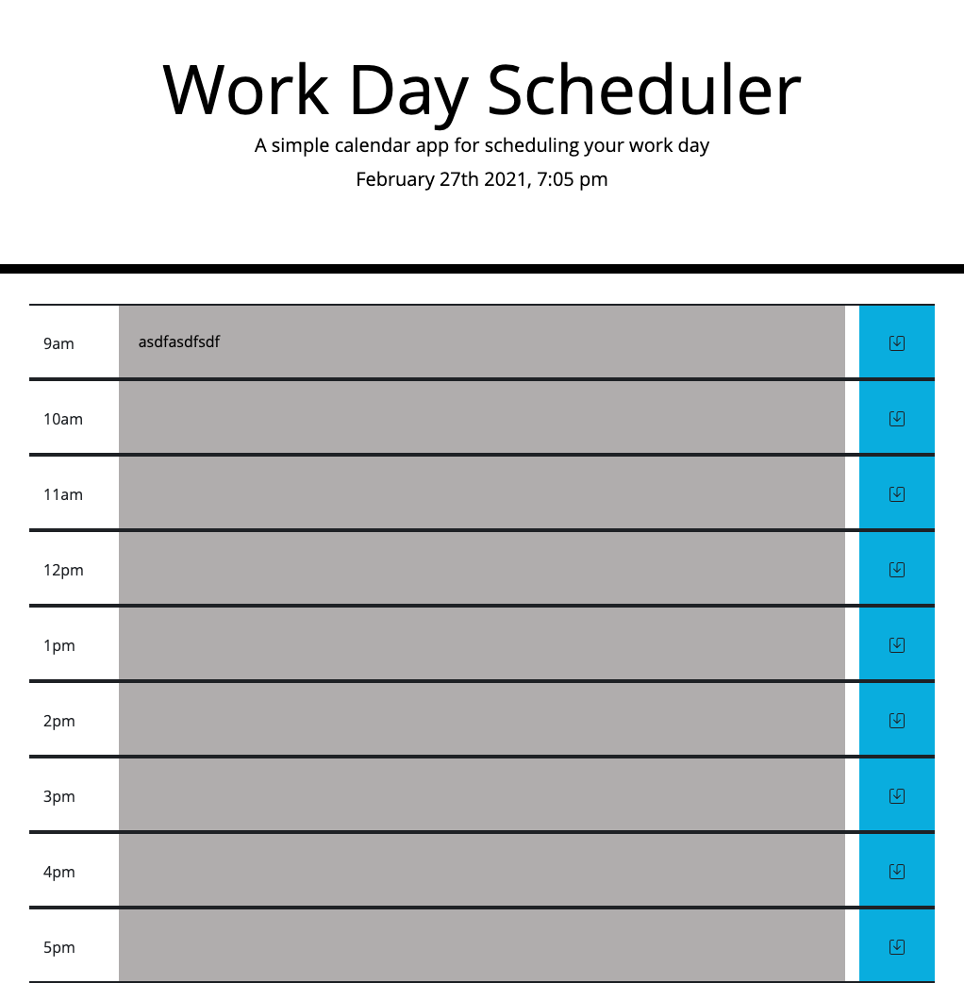

# Work-Day-Scheduler

## What, Why, and HOW
With this assignment, I was motivated to test out my jQuery skills by created a responsive, dynamic Work-Day-Scheduler. For the most part, this assignment wasn't too difficult and was a great way to cement my jQuery skills. I was also happy to practice my local storage skills. One thing that did prove to be really tricky was to change the color of the row based off whether or not that time of day had passed. If we were using military time, I could use a simple "if(row time < current time){make the background grey}". However, because our time resets at 12, I couldn't do that. I ended up having to hard code in the color changes, but I'm sure there's a way to make the code more dry, and maybe in the future I'll come back and give it another crack. 
In order to complete this assignment, I:
To achieve the end result, I:
1. Created all the styling and elements that you see on the page
2. Made sure to give all the aforementioned elements proper class names and IDs
3. Manipulated the background color based on the time
4. Saved the inputs to local storage, and set the value of the inputs to be equal to whatever was saved in local storage

Overall, this assignment was really fun. JQuery certainly makes things a lot easier, so I'm always happy whenever I have the opportunity to cement those skills.  

# Links
Link to GitHub repo: https://github.com/andrew1835/Work-Day-Scheduler
 
Link to deployed application: https://andrew1835.github.io/Work-Day-Scheduler/

# Screenshot
This screenshot shows what the home page looks like when it's 7PM (not exciting since the background color of all the rows is grey, but I coded in some different values for the rows, and the background color changed accordingly).

